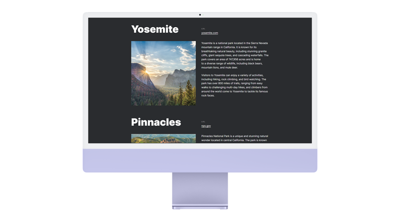

# The Journey through California

## [Project Link](https://sergeianokhin.github.io/california-travel/)

## Tech Stack

HTML, CSS, BEM

## Main goal

Design a layout that is adaptable to both desktop and mobile resolutions.

## Description

The project includes:

 - semantic markup
 - BEM methodology
 - adaptive layout for mobile devices
 - grid layout models using Flex and Grid

## Setup

There are two options:

- Run index.html using your browser
- Download project or use git clone. Than run the project from you IDE. You can use LiveServer extension for VS Code for example

